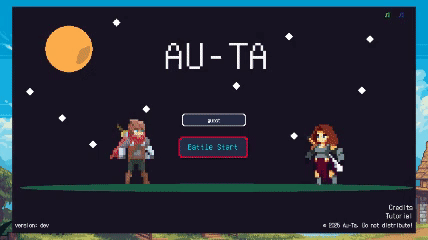

# 🔥 AUTA - リアルタイム対戦型カードバトルゲーム

> Vue.js × Phaser × Colyseus で構築した、2人チームによるリアルタイム対戦カードゲームです。

<p align="center">  </p>

---

## 📌 概要

AUTA は、スキルカードや条件カードを駆使して戦う、戦略的な1v1対戦ゲームです。リアルタイム通信と演出同期、データ駆動アセット管理など、実践的な技術課題を統合的に解決することを目的としています。

---

## 🎯 制作背景・モチベーション

- 就活やスキル証明に直結する「総合演習的な題材」を求めて選定
- リアルタイム通信／UI演出／状態管理などを1つの題材で統合的に試せる
- チーム開発での責任分担や、設計のすり合わせを経験したかった

---

## ⚙️ 使用技術と選定理由

| 技術     | 役割                | 選定理由                                           |
| -------- | ------------------- | -------------------------------------------------- |
| Vue 3    | UI/状態管理         | Composition APIとコンポーネント再利用性の高さ      |
| Pinia    | 状態管理            | 非同期処理とVueとの親和性／キャッシュ管理          |
| Phaser   | 演出/アニメーション | 高い自由度と軽量さ。Canvasベースで柔軟な演出が可能 |
| Colyseus | リアルタイム通信    | Schemaベースで状態同期しやすく、開発効率が高い     |
| Vite     | フロントビルド      | 高速なビルド／HMRで開発効率向上                    |

---

## 🏗️ アーキテクチャ概要

```
Vue（画面表示・入力）⇄ Pinia（状態管理）
            ↓
        Phaser（演出制御）
            ↓
     Colyseus（通信・同期）
```

- 状態の一元管理と責務分離（Store / Scene / Logic / Assets）
- データ駆動アセット読み込み（JSONベース）
- イベント駆動設計による状態と演出の分離

---

## 🧠 技術的チャレンジと工夫

<details>
<summary>1. フロント演出とバックエンドの同期</summary>

Colyseus の Schema による即時HP反映と、演出（攻撃アニメ等）との非同期性が課題でした。  
→ アニメーション完了フラグをクライアントで管理し、完了後に状態反映を進める「演出キューシステム」を実装。

</details>

<details>
<summary>2. データ駆動によるアセット管理</summary>

アセット定義を JSON 管理し、Phaser ローダーを自動化。  
→ 非エンジニアでも `assets.json` のみ編集で画像差し替え可能。

</details>

<details>
<summary>3. UI演出の再利用性</summary>

Vue の CustomButton コンポーネントを抽出。Props でホバー/クリック/SE挙動を指定可能にし、全UIに統一感をもたせた。

</details>

---

## 👥 チーム開発体制

| 名前      | 役割             | 主な担当                                 |
| --------- | ---------------- | ---------------------------------------- |
| Elic0de   | フロント全般     | UI設計／状態管理／演出制御／アセット連携 |
| otake1006 | サーバ／ロジック | Colyseusロジック／通信同期／ルーム管理   |

- GitHub / Discord による非同期連携
- Figma モックと Notion による設計共有

---

## 🔗 関連リンク

- [チームメンバーotakeの個人README →](./README_A.md)
- [チームメンバーElic0deの個人README →](./README_B.md)
- [デモ動画（YouTube）](#)
- [プレイ可能なビルド](https://auta-game.vercel.app)

---

## 📈 今後の展望

- マルチプレイ観戦モードの実装
- スキルやレリックのバランス調整を自動化（Pythonシミュレーション導入予定）
- チュートリアルや音声ガイドで初心者対応を強化

---

## 💬 お問い合わせ

> ご不明点や詳細については [Issues](https://github.com/example/auta-game/issues) または DM にてお気軽にお問い合わせください。
